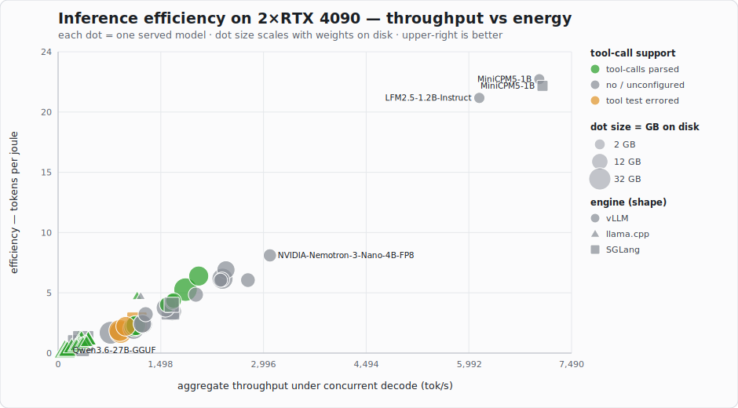

# llm-bench-2x4090

**A living throughput + compatibility database for LLM inference on dual RTX 4090 (48 GB) rigs**,
generated by an automated harness that downloads a model, serves it on **vLLM**, **SGLang**,
or **llama.cpp**, runs a fixed test battery, records the results — including *failures*, which
are data too — then deletes the weights and moves to the next one.

If you have a similar rig, these numbers tell you what will fit, how fast it runs, what it
costs in watts, which serving configs actually boot, and **which engine + quant is fastest for
a given model** — before you burn an evening finding out. The battery is identical across
engines (all speak the OpenAI API), so a vLLM FP8 row and a llama.cpp Q4_K_M row are directly
comparable.

<!--SUMMARY:BEGIN-->
**55 configs tested · 43 served · 12 did-not-serve · engines: llamacpp, sglang, vllm · updated 2026-07-21**
<!--SUMMARY:END-->

## Rig

- 2× NVIDIA RTX 4090 24 GB (Ada, no NVLink), tensor parallel 2 (llama.cpp: `--tensor-split 1,1`)
- Intel i9-14900K, 96 GB RAM, NVMe — RAM lets llama.cpp offload MoE experts for models >48 GB VRAM
- Engines: vLLM / SGLang (safetensors, TP=2) · llama.cpp (GGUF); image pinned per result row
- Linux Mint 22.2, driver 580.95.05 / CUDA 13.0

## Test battery (per model)

1. Single-stream sustained decode (1,200-token generation)
2. TTFT (streaming)
3. Long-prompt prefill (~16K tokens)
4. Aggregate throughput at 32 concurrent streams (64 × 256-token requests)
5. Tool-call smoke test (does a structured call come back parsed?)
6. GPU telemetry sampled at 2 s throughout: total board power, peak VRAM → **tok/J**

Serving auto-negotiates a config ladder (`0.92/32K → 0.85/8K`) and records which
rung worked; models that exhaust the ladder are recorded as `serve_failed` with log tails.

## Results

<!--CHART:BEGIN-->

<!--CHART:END-->

<!--RESULTS:BEGIN-->
| model | engine | quant | GB | 1-stream tok/s | prefill tok/s | agg tok/s | VRAM GB | mean W | tok/J | tools |
|---|---|---|---|---|---|---|---|---|---|---|
| openbmb/MiniCPM5-1B | vllm | native | 2.2 | 413.3 | 26969 | 7095 | 22.5 | 289 | 24.55 | not_configured |
| LiquidAI/LFM2.5-1.2B-Instruct | vllm | native | 2.3 | 482.7 | 25820 | 6144 | 22.4 | 297 | 20.69 | not_configured |
| openbmb/MiniCPM5-1B | sglang | native | 2.2 | 510.7 | 27786 | 3906 | 22.1 | 275 | 14.2 | no_structured_call |
| nvidia/NVIDIA-Nemotron-3-Nano-4B-FP8 | vllm | native | 5.3 | 267.7 | 12903 | 3090 | 22.4 | 390 | 7.92 | not_configured |
| nvidia/NVIDIA-Nemotron-3-Nano-4B-BF16 | vllm | native | 7.9 | 201.8 | 11995 | 2769 | 22.5 | 468 | 5.92 | not_configured |
| LiquidAI/LFM2.5-8B-A1B | vllm | native | 16.9 | 325.1 | 18795 | 2449 | 22.3 | 363 | 6.75 | not_configured |
| openai/gpt-oss-20b | vllm | native | 27.5 | 268.6 | 11831 | 2398 | 22.4 | 398 | 6.03 | no_structured_call |
| cyankiwi/Ornith-1.0-9B-AWQ-INT4 | vllm | native | 9.0 | 190.2 | 6674 | 2391 | 21.9 | 401 | 5.96 | not_configured |
| ibm-granite/granite-4.1-3b | vllm | native | 6.8 | 171.0 | 9989 | 2370 | 22.5 | 401 | 5.91 | no_structured_call |
| nvidia/Qwen3.6-35B-A3B-NVFP4 | vllm | native | 23.4 | 217.2 | 10113 | 2051 | 22.8 | 328 | 6.25 | ok |
| Qwen/Qwen3.6-35B-A3B-FP8 | vllm | native | 37.5 | 192.8 | 9717 | 1859 | 22.0 | 361 | 5.15 | ok |
| google/gemma-4-12b-it-qat-w4a16-ct | vllm | native | 10.3 | 125.9 | 4980 | 1684 | 22.5 | 396 | 4.25 | ok |
| RedHatAI/gemma-4-12B-it-NVFP4 | vllm | native | 10.3 | 124.6 | 4976 | 1672 | 22.6 | 402 | 4.16 | ok |
| deepreinforce-ai/Ornith-1.0-9B | vllm | native | 18.8 | 99.1 | 6741 | 1672 | 21.7 | 481 | 3.48 | not_configured |
| cyankiwi/gemma-4-12B-it-AWQ-INT4 | vllm | native | 11.2 | 124.0 | 4556 | 1597 | 22.5 | 406 | 3.93 | ok |
| empero-ai/Qwythos-9B-Claude-Mythos-5-1M | vllm | native | 18.8 | 99.0 | 6726 | 1568 | 21.9 | 426 | 3.68 | not_configured |
| Qwen/QwQ-32B-AWQ | vllm | native | 19.3 | 72.7 | 2282 | 1238 | 22.6 | 526 | 2.35 | not_configured |
| ibm-granite/granite-4.1-8b | vllm | native | 17.6 | 90.5 | 5778 | 1229 | 22.4 | 518 | 2.37 | no_structured_call |
| openbmb/MiniCPM5-1B-GGUF | llamacpp | Q4_K_M | 0.7 | 622.3 | 71804 | 1205 | 0.9 | 261 | 4.62 | no_structured_call |
| openbmb/MiniCPM5-1B-GGUF | llamacpp | Q8_0 | 1.2 | 519.4 | 76287 | 1153 | 1.1 | 249 | 4.63 | ok |
| google/gemma-4-31B-it-qat-w4a16-ct | vllm | native | 23.3 | 70.0 | 2381 | 1133 | 22.8 | 507 | 2.23 | ok |
| google/gemma-4-12b-it | vllm | native | 23.9 | 62.6 | 4611 | 1114 | 22.4 | 498 | 2.24 | ok |
| yuxinlu1/gemma-4-12B-agentic-fable5-composer2.5-v2-3.5x-tau2 | vllm | native | 23.9 | 62.5 | 4399 | 1108 | 22.4 | 516 | 2.15 | ok |
| microsoft/phi-4 | vllm | native | 29.3 | 58.3 | 4481 | 1102 | 20.8 | 553 | 1.99 | not_configured |
| nvidia/Qwen3.6-27B-NVFP4 | vllm | native | 21.9 | 69.8 | 2609 | 986 | 23.4 | 454 | 2.17 | error: <HTTPError 400: 'Bad Request'> |
| nvidia/Gemma-4-31B-IT-NVFP4 | vllm | native | 32.6 | 48.6 | 2386 | 913 | 22.8 | 541 | 1.69 | error: <HTTPError 400: 'Bad Request'> |
| Qwen/Qwen3.6-27B-FP8 | vllm | native | 30.9 | 53.7 | 2485 | 900 | 22.3 | 492 | 1.83 | error: <HTTPError 400: 'Bad Request'> |
| Qwen/Qwen3-32B-FP8 | vllm | native | 34.3 | 26.7 | 2892 | 766 | 21.0 | 465 | 1.65 | no_structured_call |
| unsloth/gpt-oss-20b-GGUF | llamacpp | Q8_0 | 12.1 | 246.3 | 20579 | 445 | 6.2 | 391 | 1.14 | ok |
| unsloth/gpt-oss-20b-GGUF | llamacpp | Q4_K_M | 11.6 | 263.1 | 20339 | 441 | 6.1 | 391 | 1.13 | ok |
| unsloth/gpt-oss-20b-GGUF | llamacpp | Q5_K_M | 11.7 | 260.4 | 20022 | 439 | 6.1 | 395 | 1.11 | ok |
| bartowski/Meta-Llama-3.1-8B-Instruct-GGUF | llamacpp | Q4_K_M | 4.9 | 162.3 | 16880 | 417 | 3.3 | 453 | 0.92 | ok |
| bartowski/Meta-Llama-3.1-8B-Instruct-GGUF | llamacpp | Q5_K_M | 5.7 | 144.1 | 16398 | 400 | 3.6 | 433 | 0.92 | ok |
| bartowski/Meta-Llama-3.1-8B-Instruct-GGUF | llamacpp | Q6_K | 6.6 | 127.5 | 15159 | 368 | 4.0 | 456 | 0.81 | ok |
| deepreinforce-ai/Ornith-1.0-9B-GGUF | llamacpp | Q4_K_M | 5.6 | 137.1 | 13336 | 363 | 3.4 | 442 | 0.82 | ok |
| deepreinforce-ai/Ornith-1.0-9B-GGUF | llamacpp | Q5_K_M | 6.5 | 124.7 | 12998 | 338 | 3.8 | 450 | 0.75 | ok |
| deepreinforce-ai/Ornith-1.0-9B-GGUF | llamacpp | Q6_K | 7.4 | 112.4 | 12196 | 314 | 4.1 | 460 | 0.68 | ok |
| deepreinforce-ai/Ornith-1.0-9B-GGUF | llamacpp | Q8_0 | 9.5 | 92.5 | 13779 | 273 | 5.0 | 389 | 0.7 | ok |
| unsloth/gemma-4-12b-it-GGUF | llamacpp | Q4_K_M | 7.1 | 96.1 | 9736 | 271 | 4.8 | 450 | 0.6 | ok |
| unsloth/gemma-4-12b-it-GGUF | llamacpp | Q5_K_M | 8.4 | 85.0 | 9561 | 250 | 5.5 | 438 | 0.57 | ok |
| unsloth/Qwen3.6-27B-GGUF | llamacpp | Q4_K_M | 16.8 | 48.0 | 3847 | 136 | 9.0 | 502 | 0.27 | ok |
| unsloth/Qwen3.6-27B-GGUF | llamacpp | Q5_K_M | 19.5 | 42.6 | 3682 | 122 | 10.1 | 504 | 0.24 | ok |
| unsloth/Qwen3.6-27B-GGUF | llamacpp | Q8_0 | 28.6 | 30.8 | 3561 | 98 | 14.1 | 427 | 0.23 | ok |

**Did not serve on this rig** — no throughput data; recorded with cause:

| model | engine | quant | GB | status | identified cause |
|---|---|---|---|---|---|
| RedHatAI/Mistral-Small-3.2-24B-Instruct-2506-FP8 | vllm | native | 25.8 | serve_failed | multimodal Pixtral processor fails during vision profiling (>20B) |
| RedHatAI/gemma-4-31B-it-FP8-block | vllm | native | 33.3 | serve_failed | engine-core init crash during weight load (FP8-block quant, >20B) |
| amazon/BMOJOF-primed-HQwen3-8B-Instruct | vllm | native | 18.5 | serve_failed | arch `hybrid_qwen3` — no vLLM implementation |
| amazon/GDN-primed-HQwen3-8B-Instruct | vllm | native | 17.0 | serve_failed | arch `hybrid_qwen3` — no vLLM implementation |
| google/gemma-4-12B-it-assistant | vllm | native | 0.8 | serve_failed | incomplete upload — multimodal Gemma-4 arch missing processor files (ships only tokenizer) |
| google/gemma-4-12B-it-qat-q4_0-unquantized-assistant | vllm | native | 0.8 | serve_failed | incomplete upload — multimodal Gemma-4 arch missing processor files (ships only tokenizer) |
| google/gemma-4-E2B-it-assistant | vllm | native | 0.2 | serve_failed | incomplete upload — multimodal Gemma-4 arch missing processor files (ships only tokenizer) |
| google/gemma-4-E4B-it-assistant | vllm | native | 0.2 | serve_failed | incomplete upload — multimodal Gemma-4 arch missing processor files (ships only tokenizer) |
| lewtun/talkie-1930-13b-it-hf | vllm | native | 26.6 | serve_failed | arch `TalkieForCausalLM` — not compatible with vLLM (incl. Transformers backend) |
| pekkAi/Gemma-4-12B-it-abliterated-NVFP4 | vllm | native | 11.7 | serve_failed | defective NVFP4 requant — MarlinNvFp4 weight-load crash on TP worker (official RedHatAI NVFP4 works) |
| unsloth/gemma-4-12b-it-GGUF | llamacpp | Q8_0 | 13.1 | serve_failed | 64.292 E common_fit_params: encountered an error while trying to fit params to free device memory: failed to create llama_context from model |
| z-lab/Qwen3-8B-DFlash-b16 | vllm | native | 2.1 | serve_failed | speculative-decoding draft model (`DFlashDraftModel`) — not standalone-servable |
<!--RESULTS:END-->

## Same model, different engine

The battery is identical across engines (all speak the OpenAI API), so these are
like-for-like: the same base model served by **vLLM** (safetensors, TP=2),
**SGLang** (safetensors, TP=2), and **llama.cpp** (GGUF quant ladder, both GPUs via
`--tensor-split 1,1`, with CPU/RAM offload for configs larger than 48 GB VRAM). Only
bases served by more than one engine are shown.

<!--XENGINE:BEGIN-->
**MiniCPM5-1B**

| engine | quant | source | GB | 1-stream tok/s | agg tok/s | VRAM GB | tok/J | tools |
|---|---|---|---|---|---|---|---|---|
| llamacpp | Q4_K_M | `openbmb/MiniCPM5-1B-GGUF` | 0.7 | 622.3 | 1205 | 0.9 | 4.62 | no_structured_call |
| llamacpp | Q8_0 | `openbmb/MiniCPM5-1B-GGUF` | 1.2 | 519.4 | 1153 | 1.1 | 4.63 | ok |
| sglang | native | `openbmb/MiniCPM5-1B` | 2.2 | 510.7 | 3906 | 22.1 | 14.2 | no_structured_call |
| vllm | native | `openbmb/MiniCPM5-1B` | 2.2 | 413.3 | 7095 | 22.5 | 24.55 | not_configured |

**Ornith-1.0-9B**

| engine | quant | source | GB | 1-stream tok/s | agg tok/s | VRAM GB | tok/J | tools |
|---|---|---|---|---|---|---|---|---|
| llamacpp | Q4_K_M | `deepreinforce-ai/Ornith-1.0-9B-GGUF` | 5.6 | 137.1 | 363 | 3.4 | 0.82 | ok |
| llamacpp | Q5_K_M | `deepreinforce-ai/Ornith-1.0-9B-GGUF` | 6.5 | 124.7 | 338 | 3.8 | 0.75 | ok |
| llamacpp | Q6_K | `deepreinforce-ai/Ornith-1.0-9B-GGUF` | 7.4 | 112.4 | 314 | 4.1 | 0.68 | ok |
| llamacpp | Q8_0 | `deepreinforce-ai/Ornith-1.0-9B-GGUF` | 9.5 | 92.5 | 273 | 5.0 | 0.7 | ok |
| vllm | native | `deepreinforce-ai/Ornith-1.0-9B` | 18.8 | 99.1 | 1672 | 21.7 | 3.48 | not_configured |

**Qwen3.6-27B**

| engine | quant | source | GB | 1-stream tok/s | agg tok/s | VRAM GB | tok/J | tools |
|---|---|---|---|---|---|---|---|---|
| llamacpp | Q4_K_M | `unsloth/Qwen3.6-27B-GGUF` | 16.8 | 48.0 | 136 | 9.0 | 0.27 | ok |
| llamacpp | Q5_K_M | `unsloth/Qwen3.6-27B-GGUF` | 19.5 | 42.6 | 122 | 10.1 | 0.24 | ok |
| llamacpp | Q8_0 | `unsloth/Qwen3.6-27B-GGUF` | 28.6 | 30.8 | 98 | 14.1 | 0.23 | ok |
| vllm | native | `nvidia/Qwen3.6-27B-NVFP4` | 21.9 | 69.8 | 986 | 23.4 | 2.17 | error: <HTTPError 400: 'Bad Request'> |
| vllm | native | `Qwen/Qwen3.6-27B-FP8` | 30.9 | 53.7 | 900 | 22.3 | 1.83 | error: <HTTPError 400: 'Bad Request'> |

**gemma-4-12b-it**

| engine | quant | source | GB | 1-stream tok/s | agg tok/s | VRAM GB | tok/J | tools |
|---|---|---|---|---|---|---|---|---|
| llamacpp | Q4_K_M | `unsloth/gemma-4-12b-it-GGUF` | 7.1 | 96.1 | 271 | 4.8 | 0.6 | ok |
| llamacpp | Q5_K_M | `unsloth/gemma-4-12b-it-GGUF` | 8.4 | 85.0 | 250 | 5.5 | 0.57 | ok |
| vllm | native | `google/gemma-4-12b-it` | 23.9 | 62.6 | 1114 | 22.4 | 2.24 | ok |

**gpt-oss-20b**

| engine | quant | source | GB | 1-stream tok/s | agg tok/s | VRAM GB | tok/J | tools |
|---|---|---|---|---|---|---|---|---|
| llamacpp | Q4_K_M | `unsloth/gpt-oss-20b-GGUF` | 11.6 | 263.1 | 441 | 6.1 | 1.13 | ok |
| llamacpp | Q5_K_M | `unsloth/gpt-oss-20b-GGUF` | 11.7 | 260.4 | 439 | 6.1 | 1.11 | ok |
| llamacpp | Q8_0 | `unsloth/gpt-oss-20b-GGUF` | 12.1 | 246.3 | 445 | 6.2 | 1.14 | ok |
| vllm | native | `openai/gpt-oss-20b` | 27.5 | 268.6 | 2398 | 22.4 | 6.03 | no_structured_call |
<!--XENGINE:END-->

## Experiment: 2× single-GPU replicas vs. tensor-parallel-2 (small models)

This rig has **no NVLink**, so `--tensor-parallel-size 2` pays a per-token PCIe
all-reduce on every forward pass. For a model small enough to fit entirely on one
24 GB card, that synchronization buys nothing — so we tried the alternative: two
independent `--tensor-parallel-size 1` vLLM instances, one pinned to each GPU
(`--gpus device=0` / `device=1`), fronted by an `nginx` round-robin proxy
(`proxy_buffering off` to preserve streaming). Same weights, same quant, same
340 W/GPU power cap, same flags as the standard leaderboard row — only the
parallelism strategy changes. Script: [`lb_bench.py`](lb_bench.py).

Two throughput measurements, both compared against the model's existing TP=2 row:

- **Combined single-stream peak** — two concurrent long-generation requests, one
  addressed directly to each replica (the real "two users, one per GPU" case).
- **Aggregate throughput** at concurrency 32 (same total load as the TP=2 test,
  now split ~16/replica) and concurrency 64 (each replica pushed to its own
  `--max-num-seqs 32` — a genuinely new capacity point the single TP=2 engine
  was never tested at).

| model | 1-stream TP=2 | 1-stream 2×TP=1 (combined) | agg@32 TP=2 | agg@32 2×TP=1+LB | agg@64 2×TP=1+LB | tok/J TP=2 | tok/J 2×TP=1+LB@64 |
|---|---|---|---|---|---|---|---|
| openbmb/MiniCPM5-1B | 413.3 | **691.4** (+67%) | 7095 | 9829 (+39%) | **19826** (+179%) | 24.55 | **47.43** |
| LiquidAI/LFM2.5-1.2B-Instruct | 482.7 | **668.9** (+39%) | 6144 | 6355 (+3%) | **13156** (+114%) | 20.69 | **27.47** |
| nvidia/NVIDIA-Nemotron-3-Nano-4B-FP8 | 267.7 | **316.9** (+18%) | 3090 | 3151 (+2%) | **4962** (+61%) | 7.92 | **9.38** |
| nvidia/NVIDIA-Nemotron-3-Nano-4B-BF16 | 201.8 | **235.5** (+17%) | 2769 | 2584 (−7%) | **4221** (+52%) | 5.92 | **7.32** |

**Findings:**

1. **Combined single-stream throughput wins outright, every time** (+17% to +67%).
   TP=2's per-token all-reduce is pure latency tax for models this small — a lone
   TP=1 replica issues tokens faster than TP=2 does, and two of them run
   independently, so the win roughly compounds.
2. **At matched total concurrency (32), the picture is mixed** — MiniCPM5-1B gains
   solidly (+39%), but LFM2.5 and the Nemotrons are roughly flat, and Nemotron-BF16
   actually regresses slightly (−7%). At 16 requests/replica, neither TP=1 engine is
   anywhere near its own batch capacity, so you're paying full dual-GPU power for a
   batch that TP=2's single larger scheduler can sometimes pack just as well.
3. **The real win is capacity, not matched-load speed**: pushing each replica to its
   own concurrency-32 ceiling (64 total, unreachable by a single `--max-num-seqs 32`
   TP=2 engine without also raising *its* limit) more than doubles throughput
   over the TP=2 baseline in every case, and does it at *better* tokens/joule
   despite ~30-45% higher mean power draw — the extra throughput outpaces the
   extra watts.

**Takeaway for small models (roughly ≤4B) on a no-NVLink 2-GPU rig**: skip tensor
parallelism. Run one full-precision replica per GPU behind a round-robin proxy —
it's faster per stream and scales further under load, with no cross-GPU
communication to tune around.

Raw results: [`results-lb/`](results-lb/).


*(agg@32 = aggregate output tok/s at 32 concurrent streams; tok/J = agg@32 ÷ mean total
board power. Table regenerated by `bench.py report`, sorted by agg@32.)*

## Rig-specific gotchas (learned the hard way, now encoded in the harness)

1. **Container CUDA compat libs kill engine workers** on host driver 580.xx — the harness
   strips `/etc/ld.so.conf.d/cuda*.conf` + `ldconfig` before launching vLLM. Without this,
   TP workers die instantly with an unhelpful "Engine core initialization failed".
2. **NVFP4 checkpoints on Ada need `--quantization modelopt`** — vLLM's auto-detect picks
   `modelopt_mixed`, which crashes during cudagraph memory profiling on 2×4090. Forcing
   plain `modelopt` serves fine (and fast).
3. **Cap `--max-num-seqs` (~32) and `--max-num-batched-tokens` (~8192)** on 24 GB cards —
   defaults are tuned for much bigger GPUs.
4. Specific vLLM nightly builds vary: `nightly-20260704` crashed where `:nightly` worked,
   same model, same flags. The image tag is recorded in every result row for this reason.

## Run it yourself

```
python3 bench.py run <hf-repo>          # one model, full cycle
python3 bench.py queue                  # process models.json queue
python3 bench.py report                 # regenerate this table
```

Requirements: docker + NVIDIA container toolkit, python3 (stdlib only). The harness refuses
to start if the GPUs are already in use. Weights download to `hfcache/` (gitignored) and are
deleted after each run unless `--keep`.

## Anatomy of a result

Every row above is backed by a checked-in JSON record in [`results/`](results/) (TP=2
leaderboard) or [`results-lb/`](results-lb/) (the replica experiment) — the exact image,
flags, serve config, raw battery numbers, and telemetry behind the number. A serving
success looks like:

```json
{
  "repo": "openbmb/MiniCPM5-1B",
  "image": "vllm/vllm-openai:nightly",
  "flags": "--trust-remote-code",
  "status": "ok",
  "serve_config": { "gpu_mem_util": 0.92, "max_model_len": 32768 },
  "vllm_version": "0.22.1rc1.dev392+g43914dd74",
  "battery": {
    "single_stream_toks": 413.3,
    "ttft_s": 0.03,
    "prefill": { "prompt_tok": 15021, "toks": 26969 },
    "sweep": [ { "concurrency": 32, "agg_toks": 7095 } ],
    "tool_call": "not_configured"
  },
  "hw": { "mean_w": 289, "max_vram_gb": 22.5, "power_limit_w": [340, 340] },
  "tok_per_joule": 24.55
}
```

A failure records the same header plus the classified cause and the tail of the vLLM log
that produced it, so a `serve_failed` row is reproducible and debuggable — not just a dead
end. The scatter plot and both tables are regenerated from these files by `bench.py report`.

## Related

Deeper batch-workload benchmarks (vision summarization/extraction over Wikipedia, quant
ladders on rented Blackwell vs this rig): see
[llm-batch-bench](https://github.com/MadCodeTX/llm-batch-bench).

## License

MIT — see [LICENSE](LICENSE).
